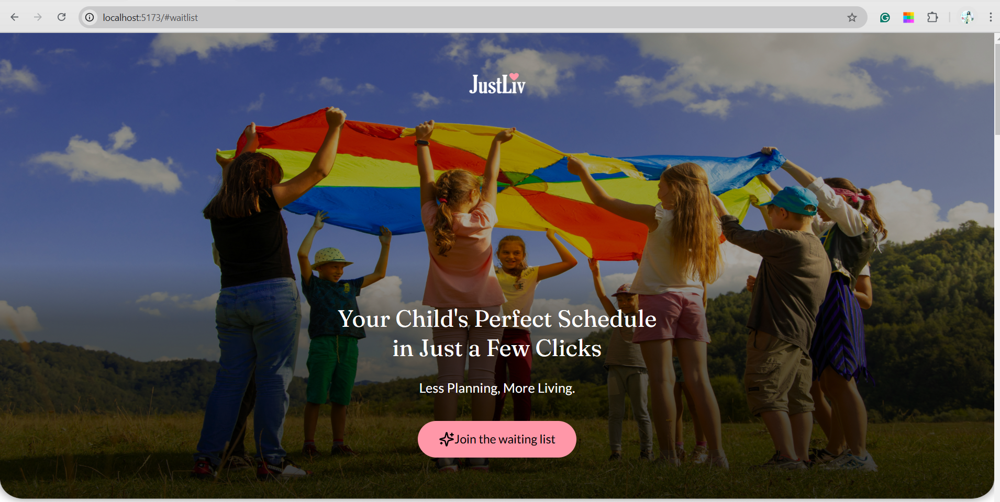
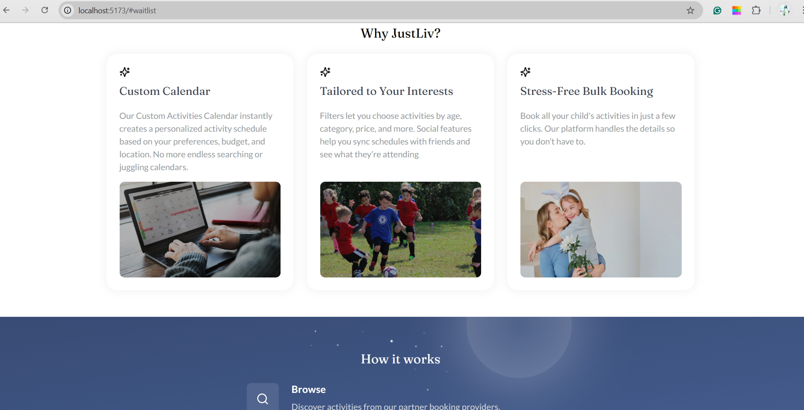

# JustLiv Homepage Clone

This project is a pixel-perfect clone of the [JustLiv](https://justliv.org/) landing page, built using **React, HTML, and CSS**. It was created as part of a screening assessment to demonstrate front-end development skills, including responsive design and UI replication.

## 🚀 Tech Stack

- **React.js** – Component-based structure
- **HTML5** – Semantic and structured markup
- **CSS3** – Styling with Flexbox, Grid, and animations

## 🎨 Features Implemented

- Fully responsive design
- Pixel-perfect UI replication
- Interactive elements (buttons, hover effects, animations)
- Mobile-friendly layout

## 📂 Project Setup & Installation

### Prerequisites

- Node.js installed on your system

### Steps to Run the Project

1. Clone the repository:
   ```sh
   git clone https://github.com/payalg22/just-liv-homepage.git
   ```
2. Navigate to the project folder:
   ```sh
   cd just-liv-homepage
   ```
3. Install dependencies:
   ```sh
   npm install
   ```
4. Start the development server:
   ```sh
   npm start
   ```
5. Open [http://localhost:3000](http://localhost:3000) in your browser.

## 📸 Screenshots




## 📝 Author

- Payal Gaikwad
- GitHub: [payalg22](https://github.com/payalg22)
